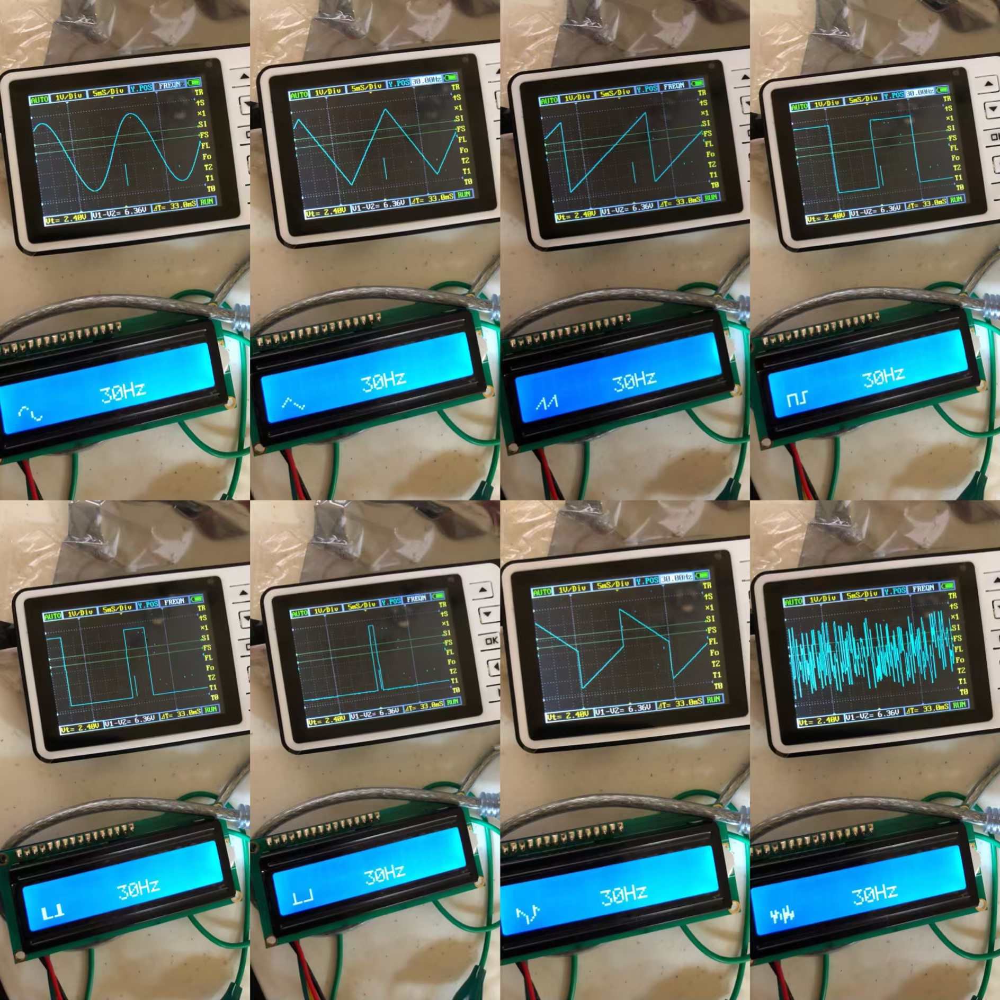
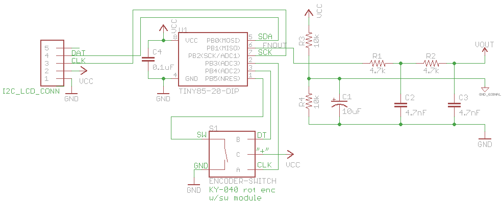
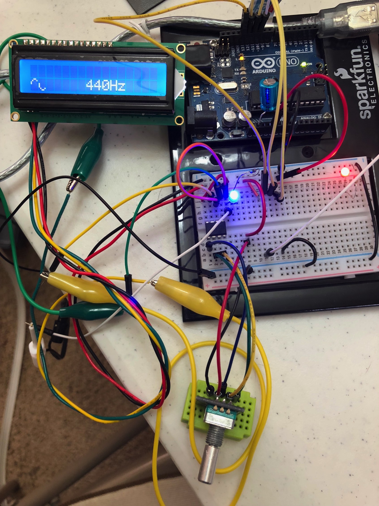
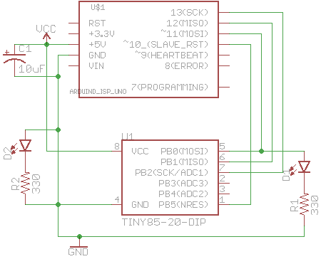
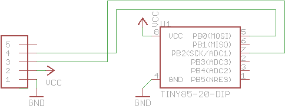
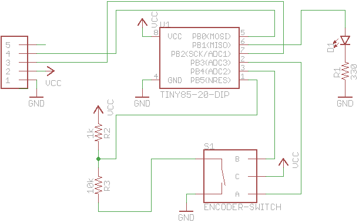
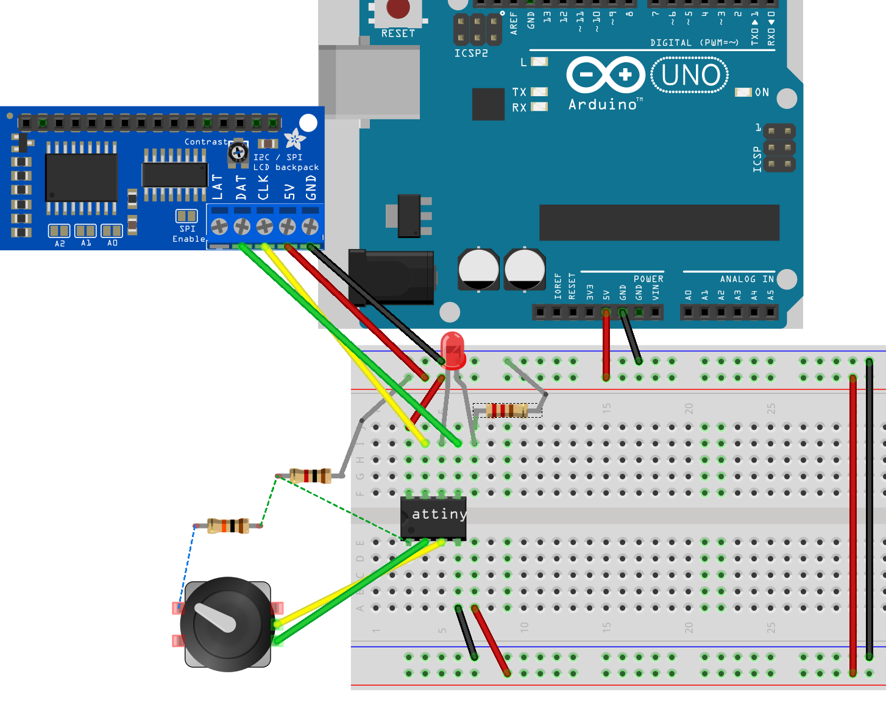

# ATtiny85 "Tiny Function Generator"

Implementation of DDS signal generation on an ATtiny85



## Motivation

I have started learning electronics again starting with the fundamentals, and had been looking at creating my own function generator using a 555 timer.  At the right time, and more versatile, there was a attiny85 [project to create simple signal generator on Hackaday](https://hackaday.com/2018/03/02/tiny-function-generator-on-the-attiny85-complete-with-oled/).  It uses ATtiny85's internal 64MHz PLL and a method named DDS (Direct Digital Synthesis) to create eight different waveforms in frequency range from 1Hz to 5kHz.

I didn't have the same I/O parts as described in David Johnson-Davies’s [Tiny Function Generator](http://www.technoblogy.com/show?20W6) blog post, so I first tried a "blind build" with a rotary encoder+switch part I already had. I built the circuit in the schematic, including the output filter (no LCD), and it didn't really work.  So instead I started with each component in turn and the ATTiny85, of course.

## Finished Circuit

After proving out the sub-components like rotary encoder and LCD, and demonstrating working code for them, I had to redraw the waveform characters for the 5x8 block characters on the HD44780. I converted to storing the custom characters in `PROGMEM` since leaving in code RAM was consuming too much memory. I also had to come up with a bank-switching scheme, since HD44780 only allows eight user-defined characters in its RAM memory at a time.

Maybe I'll be able to prove what OP said about the circuit's output passive filter characteristics when I get to those in my _The Art of Electronics_ book that I am going through.

NOTE: Original source schematic had 6.8k resistors and 1.5 nF caps on the filter, and that's what I built originally.


### Schematic




### Code


 - Arduino code [[gist](https://gist.github.com/idcrook/81ccf4e2202db0064bd4c7e9a6009105)] [[this repo](arduino/tiny_f_gen_sine_wave_3/tiny_f_gen_sine_wave_3.ino)]

### Photo




## Parts list

 - ATtiny85 PDIP-8
 - rotary encoder with switch (such as KY-040 module style)
 - I2C-capable LCD
   - e.g. [i2c / SPI character LCD backpack](https://www.adafruit.com/product/292)  and a [Standard HH44870 16x2 Character LCD](https://www.adafruit.com/product/181)
 - Arduino Uno, connected through USB to Arduino host computer
 - 10 uF electrolytic cap
 - half-size solderless breadboard with power rails to place ATTiny85 8-pin DIP onto
 - a couple smaller 10-11 row mini-breadboards are handy
 - a couple through-hole LEDs and 330Ω current-limiting resistors
 - about two dozen jumper wires, small alligator-clip jumps
 - 1k and 10k resistors
 - powered USB hub to connect Arduino through to computer, and a computer such as one running macOS


Filter components

 - 4.7k resistor X 2
 - 10k resistor X 2
 - 4.7 nF filter cap X 2
 - 10 uF electrolytic cap
 - 0.1 uF cap

Tools

 - tiny needle nose pliers helps to insert wires into solderless breadboards
 - tiny Philips head screwdriver for adjusting and wiring terminals on i2c backpack


## Programming ATTiny85 using Arduino as ISP

Wiring up an Arduino UNO to flash an ATtiny is pretty quick and easy

 - Arduino Uno, connected through USB to Arduino host computer
 - 10 uF electrolytic cap
 - half-size solderless breadboard with power rails to place ATTiny85 8-pin DIP onto
 - couple through-hole LEDs and 330Ω current-limiting resistors
 - about a dozen jumper wires

First flash the Uno board with `ArduinoISP` sketch. There is a built-in "example" sketch to achieve this: `File -> Examples -> 11.ArduinoISP -> ArduinoISP`

Now to flash the ATtiny itself, you'll need board support within Arduino app.  Arduino "board" support for ATtinys is available from:
<https://github.com/SpenceKonde/ATTinyCore>

Once [that is installed](https://github.com/SpenceKonde/ATTinyCore/blob/master/Installation.md), you can configure it for flashing our ATtiny85.

ATTiny Core settings in Arduino, using "Arduino as ISP" as "Programmer" (in `Tools` menu in Arduino app).

Run "Burn bootloader" before uploading sketch the first time (only needs to be done once).

 - Board: "ATtiny25/45/85
 - Chip: "ATtiny85"
 - Clock: "8 MHz (internal)
 - B.O.D.: "B.O.D. Disabled"
 - LTO (1.6.11+ only): "Disabled"
 - Timer 1 Clock: "CPU"

Now these settings should work to flash your development sketches onto ATtiny.

### Schematic



## Connecting an LCD display over I2C

Found that I had a 16x2 character LCD display (HD44780 type) with an I2C backpack, and wanted to test it. Used `TinyWireM` and `TinyLiquidCrystal` Arduino libraries.

 - Arduino test code [[gist](https://gist.github.com/idcrook/e0e123173be3234e7cd684f76473e1cb)] [[this repo](arduino/tiny_i2c_lcd/tiny_i2c_lcd.ino)]

### Schematic



## Connecting an LCD display and rotary encoder with switch

The rotary encoder I had was quite a different topology than OP.  I had quite a bit of trial-and error and troubleshooting to get to a robust, interrupt-driven code implementation in Arduino.

I use an [Addicore Rotary Encoder with Push Switch](https://www.addicore.com/rotary-encoder-knob-p/ad267.htm) which is an unbadged KY-040 rotary encoder module with switch AFAICT.

This version does not pull down the active-low R̅E̅S̅E̅T̅ all the way to logic zero, but instead uses a 1:10 voltage divider (and the ADCO available on pin 1) to detect a button press. The code is able to read ADC voltage and use that to determine whether input voltage falls below 10/11 Vcc (which occurs when button in rotary coder is pressed).

 - Arduino test code [[gist](https://gist.github.com/idcrook/eacea1b55d9f9f9b945036c467808080)] [[this repo](arduino/tiny_i2c_lcd_rotary_encoder2/tiny_i2c_lcd_rotary_encoder2.ino)]

BTW, here is one way to get the "combining overline" text that you see on active-low signal/pin names (in python).

```python
print('R'+u'\u0305' + 'E'+u'\u0305' + 'S'+u'\u0305' + 'E'+u'\u0305' + 'T'+u'\u0305')
```

### Schematic



breadboard mockup


